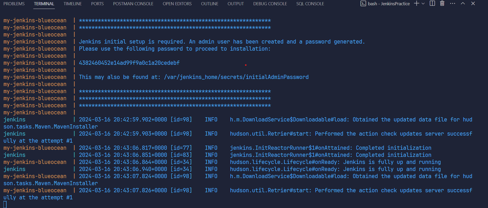
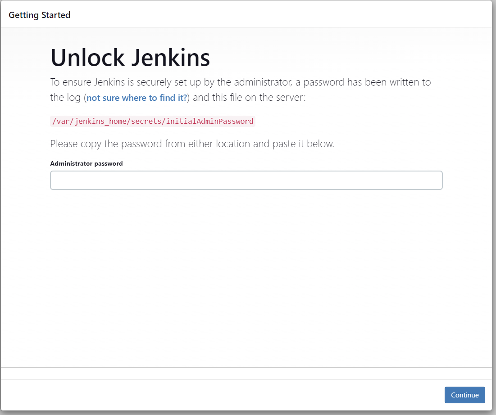
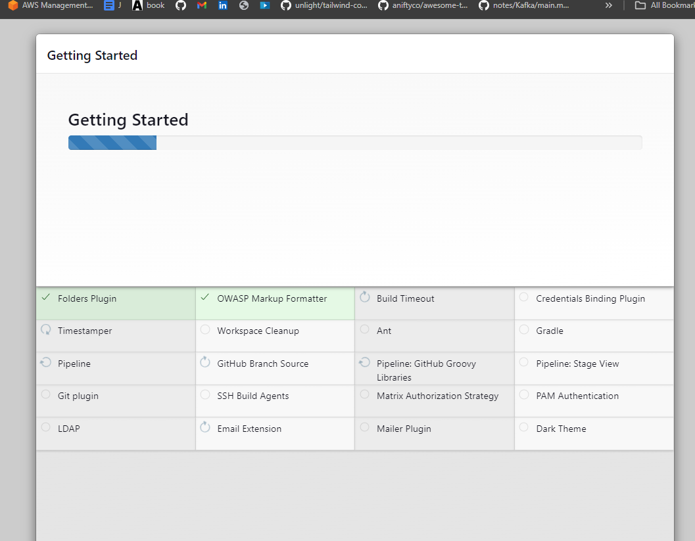
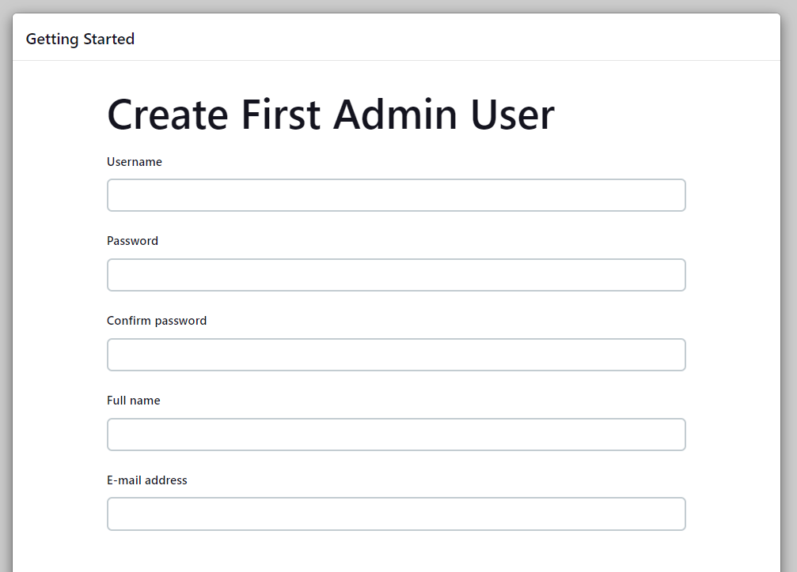
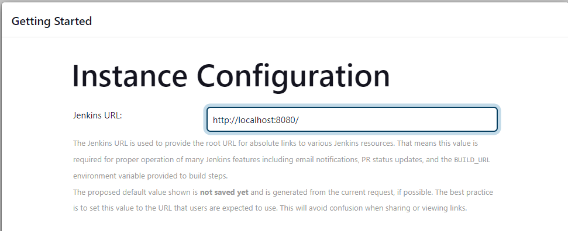

https://www.jenkins.io/doc/book/installing/docker/

https://github.com/devopsjourney1/jenkins-101

List of available environment variables
- http://localhost:8080/env-vars.html/

1. Docker compose up
   
2. Go to localhost:8080 post installation setup wizard
  - 
  - copy the generated password  
3. Install recommended plugins
  - 
4. Create 1st admin user:
   - 
   - user: boss
   - pwd: bosspwd
5. 
